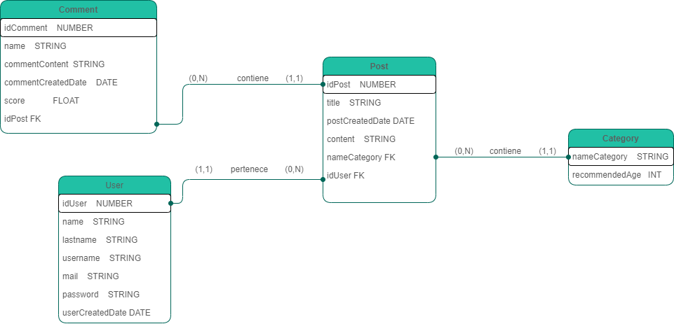
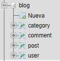
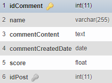
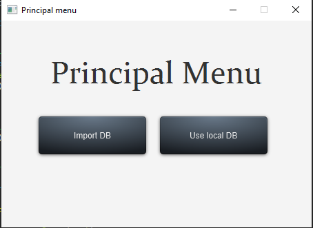
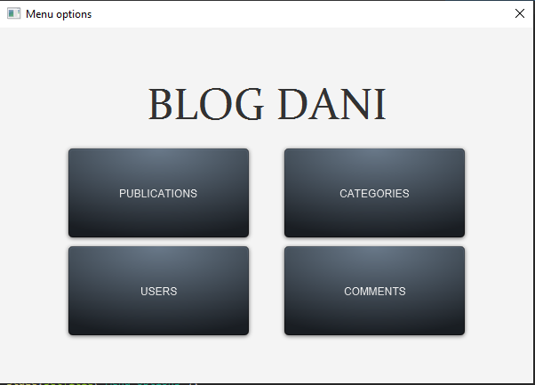
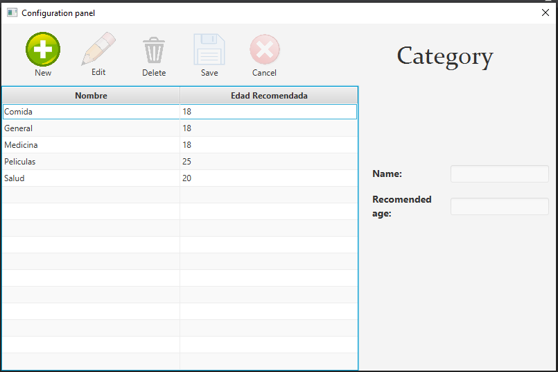
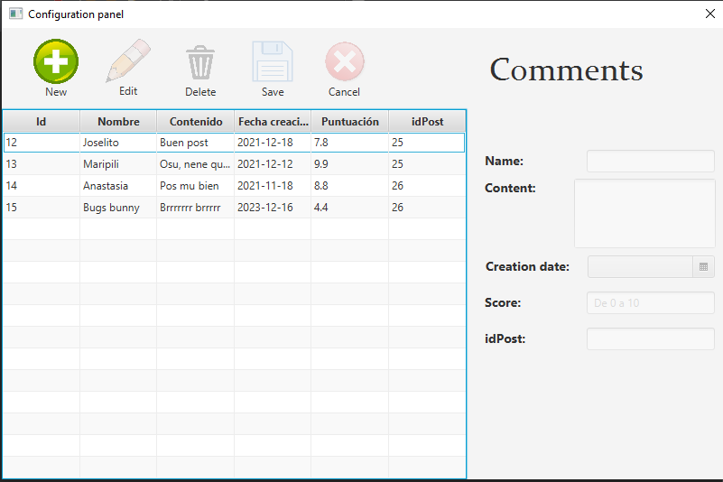
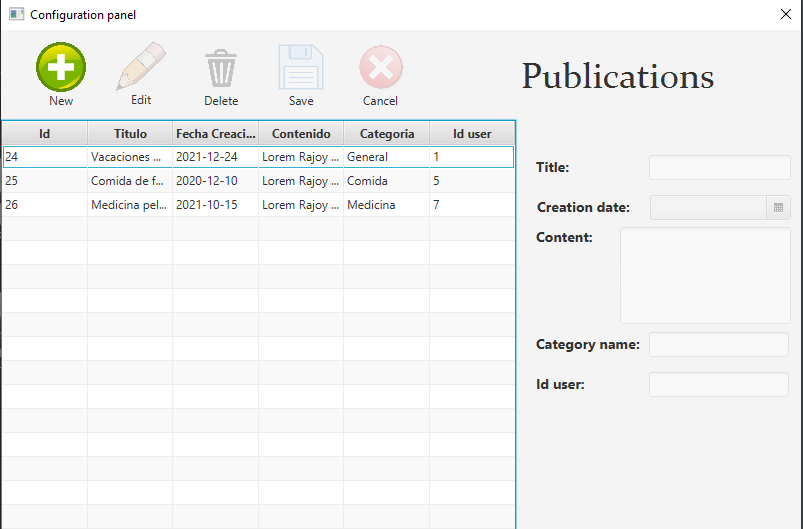
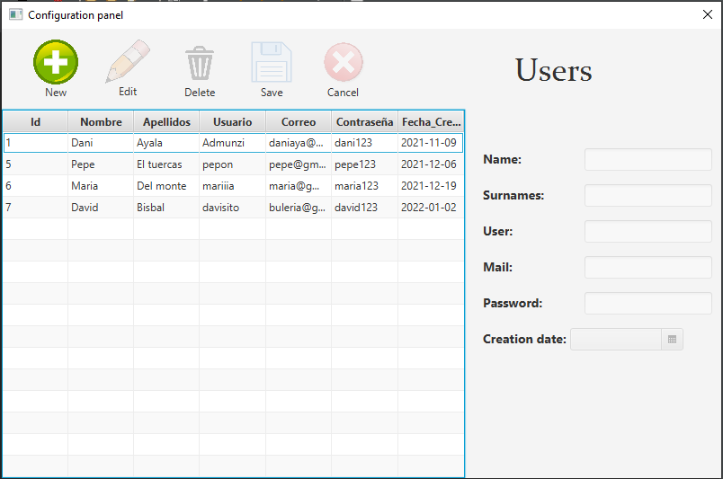

# CRUD Blog JDBC

## Data Base info

### Entity–relationship model

### Table PhpMyAdmin

### Attribute info

## Application Dashboards

### Principal menu

- Import DB -> The table is dropped and the default data is re-created and inserted.
- Local DB -> Use an already installed database.
  

### Principal options

  Panel where you can access the different options
  

### Publications, categories, users, comments panel.
  

